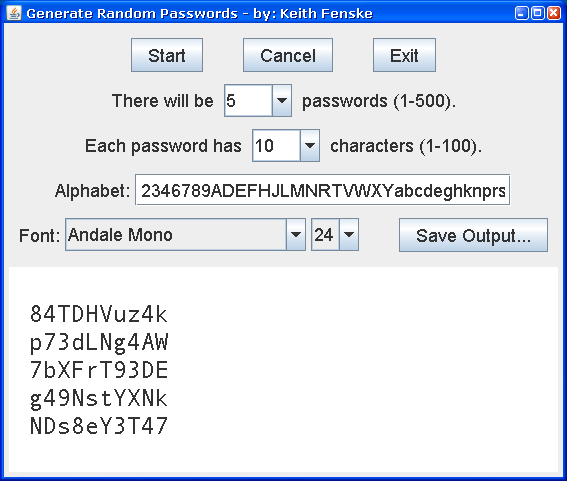

### Random Password (Java)

by: Keith Fenske, https://kwfenske.github.io/

RandomPassword is a Java 1.4 application to generate random passwords given an
alphabet (list of available characters), the length of each password (in
characters), and the number of passwords required. The default alphabet uses
letters and digits that most people can distinguish when written down on a
piece of paper. This alphabet does not have to be unique, and may repeat
characters so they are more likely to appear.

Java strings are encoded
in [UTF-16](https://en.wikipedia.org/wiki/UTF-16) format. Since this program
randomly selects text from a string, you should not use characters above
Unicode U+FFFF in your alphabet, or else an unmatched half may be taken from a
surrogate pair. The correction for Java 5.0 or later is left as an exercise.

Download the ZIP file here: https://kwfenske.github.io/random-password-java.zip

Released under the terms and conditions of the Apache License (version 2.0 or
later) and/or the GNU General Public License (GPL, version 2 or later).

